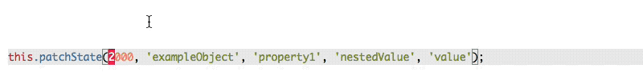
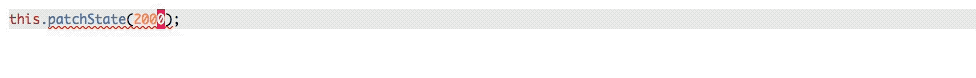

# rxjs-observable-store

[](https://www.npmjs.com/package/rxjs-observable-store)
[](https://www.npmjs.com/package/rxjs-observable-store)
[](https://github.com/georgebyte/rxjs-observable-store/blob/master/LICENSE)

A state management solution implemented using RxJS to mimic Redux architecture.

Read my blog post [State management in Angular with observable store services](https://georgebyte.com/state-management-in-angular-with-observable-store-services/) to learn more about how to use the `rxjs-observable-store` package to manage state in front-end applications.

## Getting started

**Prerequisites:**  
Lowest TypeScript support starts at version 3.5.

**Installation:**

```bash
npm install rxjs-observable-store --save
```

**Usage example:**

```typescript
import {Store} from 'rxjs-observable-store';

class ExampleState {
    exampleText = 'initial text';
    exampleObject = {
        property1: {
            nestedValue: {
                value: 1000,
            },
        },
    };
}

class ExampleStore extends Store<ExampleState> {
    constructor() {
        super(new ExampleState());
    }

    updateExampleText() {
        this.setState({
            ...this.state,
            exampleText: 'updated text',
        });
    }

    updateNestedValue() {
        this.patchState(
            2000,
            'exampleObject',
            'property1',
            'nestedValue',
            'value'
        );
    }
}

class TestComponent {
    store: ExampleStore;

    constructor() {
        this.store = new ExampleStore();

        this.store.state$.subscribe(state => {
            // Logs the updated state on every state change
            console.log(state);
        });

        this.store.onChanges('exampleObject', 'property1', 'nestedValue', 'value').subscribe(value => {
            // Logs the updated value only when state.exampleObject.property1.nestedValue.value changes
            console.log(value);
        });

        setTimeout(() => {
            this.store.updateExampleText();
        }, 1000);

        setTimeout(() => {
            this.store.updateNestedValue();
        }, 2000);
    }
}
```

## API

**Store's public properties:**

**`state: <S>`**  
Current state snapshot.

**`state$: Observable<S>`**  
RxJS Observable of state.

**Store's public methods:**

**`onChanges(...path: (string|number|symbol)[]): Observable<any>`**  
Get an RxJS Observable of state at `path` used to subscribe to partial state changes.

**`setState(nextState: S): void`**  
Set store's state to `nextState`.

**`patchState(value: any, ...path: (string|number|symbol)[]): void`**  
Set store's state at `path` to `value`.

Notes:  

* When using TypeScript, errors are thrown for nonexisting `path` and wrong `value` type:  
  
* Path autocompletion works as well (9 levels deep):  

